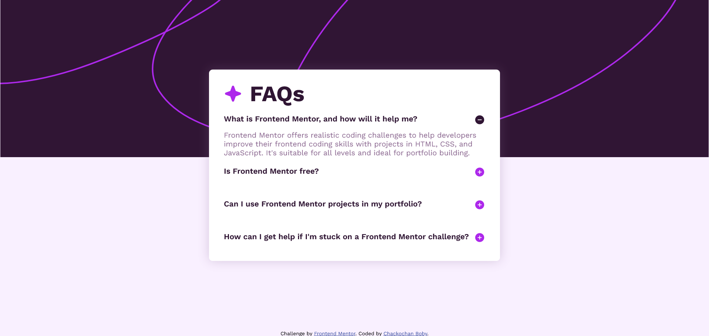
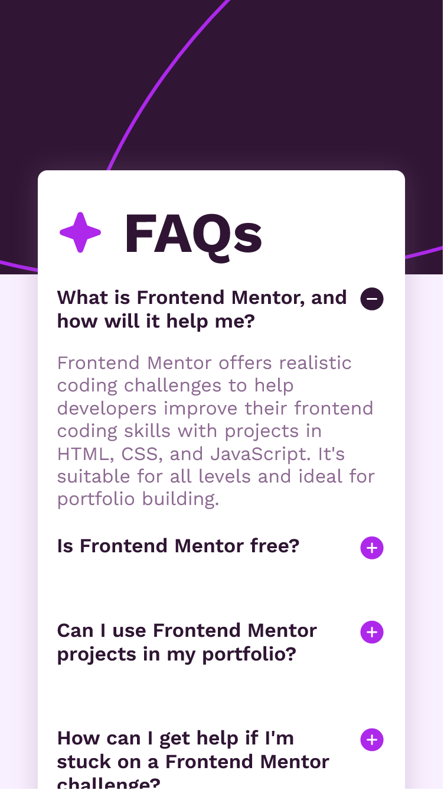

# Frontend Mentor - FAQ accordion solution

This is a solution to the [FAQ accordion challenge on Frontend Mentor](https://www.frontendmentor.io/challenges/faq-accordion-wyfFdeBwBz). Frontend Mentor challenges help you improve your coding skills by building realistic projects. 

## Table of contents

- [Overview](#overview)
  - [The challenge](#the-challenge)
  - [Screenshot](#screenshot)
  - [Built with](#built-with)
  - [Links](#links)
- [Author](#author)

## Overview
This project is an interactive FAQ page built with vanilla JavaScript, HTML, and CSS. The page features a mobile-first design approach, providing a responsive and accessible user experience.

### The challenge
Users should be able to:

- Hide/Show the answer to a question when the question is clicked
- Navigate the questions and hide/show answers using keyboard navigation alone
- View the optimal layout for the interface depending on their device's screen size
- See hover and focus states for all interactive elements on the page

### Screenshot

### Built with

- HTML: Defines the structure and content of the page.
- CSS: Provides styling, including responsive design, transitions, and hover effects.
- JavaScript: Handles interactivity, such as showing and hiding answers based on user clicks.

### Links

- Solution URL: [Add solution URL here](https://your-solution-url.com)
- Live Site URL: [Add live site URL here](https://your-live-site-url.com)

## Author

- Github - [Chackochan Boby](https://github.com/ChackochanBoby)
- Linkdin -[Chackochan Boby](https://www.linkedin.com/in/chackochan-boby/)
- Frontend Mentor - [@ChackochanBoby](https://www.frontendmentor.io/profile/ChackochanBoby)

